# Better rolls for SWADE

This module adds a new rolling mode to the SWADE system that add the ability to make faster and more complex rolls. I truly believe that it makes gaming faster and more enjoyable, but:

* This is more complex than system default rolls. It's quite probably that you don't need it. Please try SWADE without it first and only check it if you feel rolls could be improved.
You need to be familiar with Savage Rolls rules to use it. You need to know wich dice are discarded, what is raise damage, and in general it is not a good module for begginers in the system. It could be confusing. So, again, please use the base system and get familiar with it before usng this module

## Skill Rolls

The module will show an image before the skill name. 

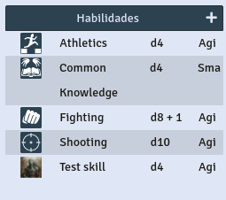

When you click on it, it will roll that skill directly with the following format

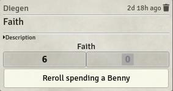

The big numbers include all the penalties show below, including status, wounds and fatigue.
The wild die is always the last one and it's marked with a shadow of the dice size. Used rolls will be black, discarded ones will be light grey.
You can clink on the result to get more information (explosion, dice faces, modifiers)

The three numbers in the bottom part are dice result, modifiers and difficulty. They can be edited, but take care that this is per client, ie. what you do here is not seen by the other players.

The target number will default to 4 except when you are making a figthing check and there is a token selected. In that case it will default to the token parry.

Clicking in the "Rerroll spending a Benny button" will repeat the roll, removing a Benny from the character. If the roll was made by a game master and the character has no bennies it will subtracted from gm bennies.

The systems always roll a wild die for extras but it will never get selected (it will always show as gray). It is used to detect fumbles and can also be used for group rolls.

Red numbers means that a fumble has been rolled, explosions are marked in blue.

You can right click to show a menu that will let you roll multiple trait dice like a high rof attack, or Frenzy

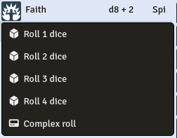

## Skill Rolls (npc sheets)

You can now turn skill rolls for NPCs in the options.

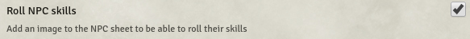

When enabled the default npc sheet will be modified to add small images before the skills. Clicking on then will make the roll.

## Complex Rolls

You can call a complex roll either from the context menu shown after rigth clicking an image or by clicking on it with the ALT key pressed. It will show this window:

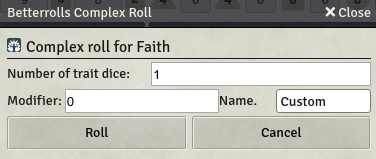

Here you can any number of trait die and add a custom modifier to the roll. You can also name that modifier.

## Roll results row

If you find the result row distracting, or you just don't like it, you can collapse it by default using the settings

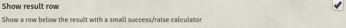

If you uncheck this option (should be enabled by default) the rolls will look like this:

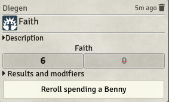

You can still click on it to expand it in case you want to see it.

## Weapon Rolls

Weapon rolls can be toggled from the weapon image either in the inventory or quick access.
By default it will roll every possible dice: attack, damage and raise damage.

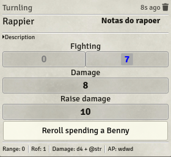

This can be disabled in settings. (From version 1.0.6 this is now a world setting)

The simple roll looks like that:

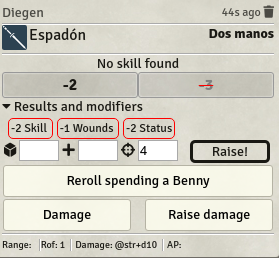

You can make it even simpler collapsing the result row (see above).
You can then use the buttons to re-roll the attack or roll damage.

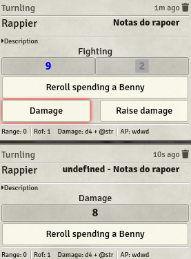

You can use the ROF field of the weapon to force multiple attacks, including using edges like frenzy.

The system will assume any weapon with no or 0 range uses fighting.
Weapons with range will use shooting unless @str is used in damage field, then it will use athletics.

## Power rolls

They work mainly like the others. You need to click on the image to roll the power.

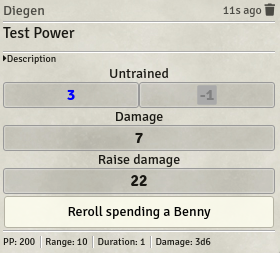

If the power has a damage field it will roll or ask to roll damage depending on settings.

The system will look for all arcane skills on the sheet and roll the last one. You can force the use of any skill by putting its name on the Arcana field of the power. Beware of translations 

## Character sheet

To be able to use right click context menus, the modules needs to make some changes to the default sheet.

The most noticeable one is the removal of all the internal scroll areas and making the full sheet scrollable

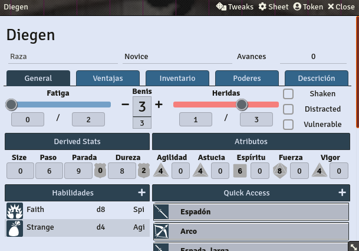

As a result the sheet now can be shrinked and works better on smaller screens.

## Other features.
- Skill names will be recognised in English, German or Spanish. You can use any language for an arcane skill as long as it's on the arcane field of a power.
- Hellfrost skills supported (only in English or German)
- Support for Dice so Nice

## Acknowledgements
- Atropos for making Foundry VTT
- RedReign for Better Rolls 5e
- FloRad for making the SWADE system for Foundry
- All the nice people in the #swade channel of the official discord. Such a great community,

## License
The source code is licensed under GPL-3.0.
