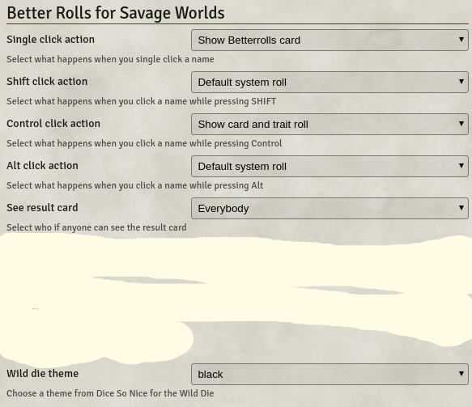
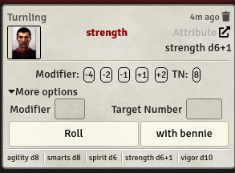
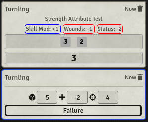
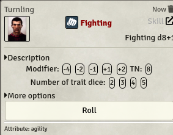
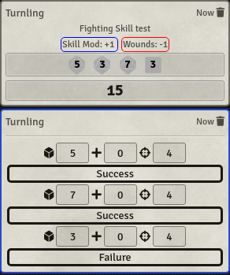
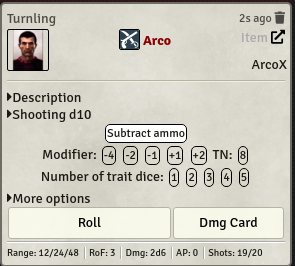
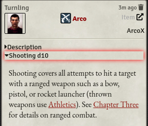
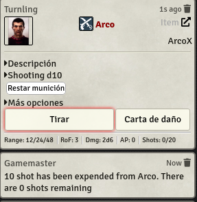
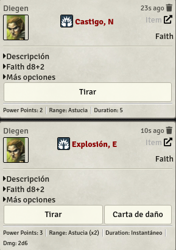

# Better rolls for SWADE (Alpha version)

This is an alpha for version 2 of the module. If you are not familiarized with it, you are probably better using the 1.x version.

Please leave your feedback on the official Foundry discord. Feel free to ping me if you want. 

Criticism, feature requests, and UI changes are all welcome but, if you want me to do something about it, please be as detailed as you can. Please, at the very least, tell me what you expect and why do you believe your approach is better.

This module adds a new rolling mode to the SWADE system that adds the ability to make faster and more complex rolls. I truly believe that it makes gaming faster and more enjoyable, but:

* This is more complex than system default rolls. It's quite likely that you don't need it. Please try SWADE without it first and only check it out if you feel rolls could be improved.
* You need to be familiar with the rules of Savage Worlds to use it. You need to know e.g. which dice are discarded and how damage is affected by raises; generally speaking, this is not a good module for beginners. It could be confusing. So, again, please use the base system and get familiar with it before using this module.

## Settings

This module is quite configurable. Most people should take a look at the setting and make sure that they reflect their preferences just after installing. These are the exposed settings:

The first options define what happens when you click with different keys pressed. You can choose three actions:

* Default system roll: Better rolls will do nothing, the default system behaviour will be preserved.
* Show BetterRolls card: A card will be shown where you can click to roll with different options (see below).
* Show card and trait roll: The same card will be displayed, but it also will make a roll with the default options, show it, and (if it is enabled) show the results.
* Show card and roll trait and damage: The full automation option. This will show the card, roll the relevant trait, and if it is an item with a damage field it will also roll damage if the trait roll was successful. It will roll raise damage for a raise result in the trait test.

The next setting ("See result card") lets you choose if a result card will be shown after a roll; and, if it is, who can see it: either everybody or just the master. Note that the master can make it public later with the right--click context button.

The custom bennie images lets you select a front and back image for the benny animation shown when you spend one. The front image will also be shown on the Official Character Sheet.

Leave both fields empty to use the default bennies, or left the back empty to use the same image for both sides.

Finally, if you are using `Dice So Nice`, you can set the theme for the Wild Die. To make it easy to spot, I recommend using a flat theme like white or black.

## Attribute card

This is the card that is shown after clicking on an attribute name:

You can do quite a lot of things here:

* Click the portrait to open, minimize, and maximize the character sheet.

* Click on More options to expand a small form to add your own modifier or target number.

Finally, you can click in the big buttons to roll the attribute. If you use the smaller `with bennie` button, it will subtract one bennie from your pool (or the master pool, if you are the master and the actor has no bennies available).

## Modifier row

Betterrolls will add this section above the chat window

You can use this to quickly add modifiers to a roll.

Click on any element to selec it, its background will turn white. If you click on it again, its background will become red. Finally, another click will deselect it changing it background to the same as the char window.

White backgrounds elements will be used in the next roll ant automatically deselected. Red backgounds ones will be keep after the roll, until you deselect them manually.

Use the "Trait roll modifier" line to affect any trait roll either from a skill, attribute or item
Use "Number of trait dice" to use multiple trait dice on a skill roll, either from a skill or item card. Attributes are not current supported
Finally de "Damage roll modifier" adds modifiers to damage rolls.

## Result card

After clicking `Roll` the module will roll a standard system roll; if you enabled it in settings, it will show a result card after it.

In the image above you can see two cards: the first one is a system roll (with minor modifications), the second one is the result card.

Both rows can be expanded to show more details about the roll or the result.

## Skill card

The skill cards are very similar to attribute ones.

The main difference is the addition of a collapsed skill description and the ability to roll any number of trait dice. This is useful for some spells, frenzy attacks, etc...

The result card will show one row of results for each dice.

## Item cards

Item cards can be the simplest or the most complicated of the cards.

A simple item, like an armor would look like this:

If there is a description available, it will show it. The next screenshots shows the Blind hindrance with the official Core Rules module:

## Weapon cards

Weapon are the most complicated of the items cards. They look like that.

It's quite similar to other item cards, but there some differences.

Description starts collapsed because the card is quite big.

There is related ability, in this example shooting. Clicking on it will show its description.

Afterwards there is an option row similar to the one shown on skills. It works the same.

If the weapon has ammunition, there is an option (selected by default) to remove shots from it.

Finally, there are two buttons, one for rolling the skill and another one to show the damage card.

If the skill is fighting, the target number of the roll will be taken from the parry value of the first targeted token.

Weapon cards also discount ammo from weapons who have defined a number of shots.

If you don't want it to subtract then, please unmark "Subtract ammo". Please note that it will use the normal bullets per rof table in SWADE. If you are using some special attack, like "Rapid Fire" edge, you will need to count ammo yourself.

## Power cards

Power cards are very similar to weapon cards, and for now they work the same.

## Drag and Drop

## Dice Tray support

## Custom Bennies

The module come with some custom bennies that can be found in the assets/bennies folder.

Currently, it ships with some classical roman and greek coins.

## Macros and API

THIS PART OF THE DOCUMENTATION IS OUTDATED, PLEASE CHECK THE SOURCE FOR CURRENT OPTIONS.

The following information assumes a passing knowledge of both javascript and Foundry API. It's geared towards macro or module developers.

The module exposes an API in game.brsw, these are the current supported functions:

### async function create_attribute_card(origin, name)

* Creates a chat card for an attribute
*
* @param {Token, SwadeActor} origin  The actor or token owning the attribute
* @param {string} name The name of the attribute like 'vigor'
* @return A promise for the ChatMessage object

Example:

game.brsw.create_atribute_card(canvas.tokens.controlled[0], "Strength")

### function create_attribute_card_from_id(token_id, actor_id, name)

 * Creates an attribute card from a token or actor id
 *
 * @param {string} token_id A token id, if it can be solved it will be used before actor
 * @param {string} actor_id An actor id, it could be set as fallback or if you keep token empty as the only way to find the actor
 * @param {string} name: Name of the attribute to roll, like 'vigor'
 * @return {Promise} a promise fot the ChatMessage object

Example:

game.brsw.create_attribute_card_from_id(canvas.tokens.controlled[0].id,'', 'spirit')

### async function roll_attribute(character, attribute_id, html, expend_bennie)

 * Roll an attribute showing the roll card and the result card when enables
 *
 * @param {SwadeActor, token} character, The instance who is rolling
 * @param {string} attribute_id, Attribute name like 'spirit'
 * @param {string} html, The html code from a card that will be parsed for options, it could be an empty string.
 * @param {boolean} expend_bennie, True if we want to spend a bennie

Example:

game.brsw.roll_attribute(canvas.tokens.controlled[0], 'spirit', '', false)

### async function create_skill_card(origin, skill_id)

* Creates a chat card for a skill
*
* @param {Token, SwadeActor} origin  The actor or token owning the attribute
* @param {string} skill_id The id of the skill that we want to show
* @return A promise for the ChatMessage object

Example:
game.brsw.create_skill_card(canvas.tokens.controlled[0], canvas.tokens.controlled[0].actor.items.filter(item => {return item.name==="Athletics"})[0].id)

### function create_skill_card_from_id(token_id, actor_id, skill_id)

* Creates a skill card from a token or actor id, mainly for use in macros
*
* @param {string} token_id A token id, if it can be solved it will be used
*  before actor
* @param {string} actor_id An actor id, it could be set as fallback or
*  if you keep token empty as the only way to find the actor
* @param {string} skill_id: Id of the skill item
* @return {Promise} a promise fot the ChatMessage object

Example:
game.brsw.create_skill_card_from_id(canvas.tokens.controlled[0].id, '', canvas.tokens.controlled[0].actor.items.filter(item => {return item.name==="Athletics"})[0].id)

### async function roll_skill(character, skill_id, html, expend_bennie)

 * @param {SwadeActor, token} character, The instance who is rolling
 * @param {string} skill_id the id of the skill we are going to roll
 * @param {string} html, The html code from a card that will be parsed for options,
 it could be an empty string.
 * @param {boolean} expend_bennie, True if we want to spend a bennie

Example:
game.brsw.roll_skill(canvas.tokens.controlled[0], canvas.tokens.controlled[0].actor.items.filter(item => {return item.name==="Athletics"})[0].id, '', false)

## Authors
- JuanV, base of drag and drop support, custom bennies, translation infrastructure.
- SalieriC, manual ammunition management.
- Kandashi, manual ammunition management.
- Sergut, documentation corrections.
- Javier Rivera, most code and this doc.
- Art assets shipped with the system are attributed by a README file in the same directory.
- The shipped bennies are property of Classical Numismatic Group, Inc.

## Translations
- Catalá: David Montilla

## Acknowledgements
- Atropos for making Foundry VTT
- RedReign for Better Rolls 5e
- FloRad for making the SWADE system for Foundry
- All the nice people in the #swade channel of the official discord. Such a great community,

## License
The source code is licensed under GPL-3.0.
