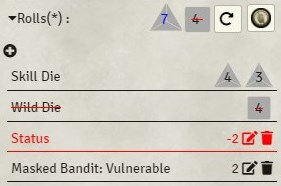
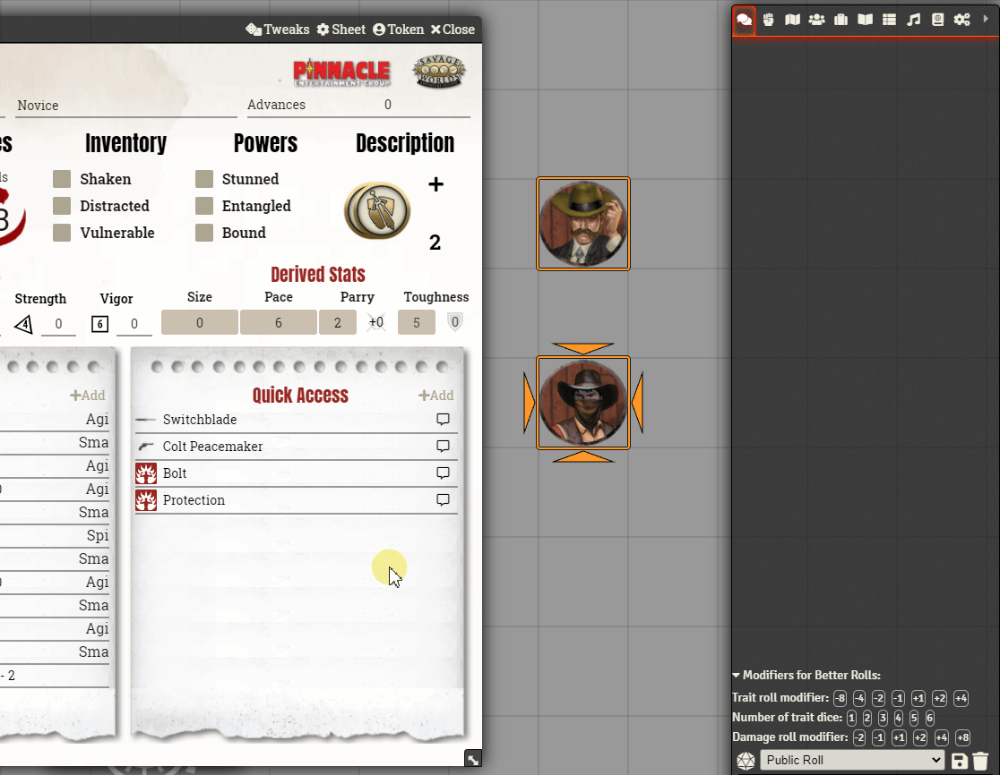

# Better rolls for SWADE 

Please leave your feedback on the official Foundry discord. Feel free to ping me if you want. 

Criticism, feature requests, and UI changes are all welcome but, if you want me to do something about it, please be as detailed as you can. Please, at the very least, tell me what you expect and why do you believe your approach is better.

This module adds a new rolling mode to the SWADE system that adds the ability to make faster and more complex rolls. I truly believe that it makes gaming faster and more enjoyable, but:

* This is more complex than system default rolls. It's quite likely that you don't need it. Please try SWADE without it first and only check it out if you feel rolls could be improved.
* You need to be familiar with the rules of Savage Worlds to use it. You need to know e.g. which dice are discarded and how damage is affected by raises; generally speaking, this is not a good module for beginners. It could be confusing. So, again, please use the base system and get familiar with it before using this module.

## Settings

Better rolls 2 offers a few display modes that you can switch between using different Click actions:

### Show Better rolls card (Default)
This option will display the Better Rolls 2 card, when single clicking on a Trait, Weapon or Power. See details below. This option is useful, if you need to add some settings on the card itself (like Wild Attack or changes in Ammo or Power Point handling.

### Show card and trait roll
This option will display the card and automatically rolling the selected Trait (Powers and Weapons rely on the arcane/weapon skill). It will automatically factor in the Better Rolls modifiers from the chat bar as well as modifications through Wounds, Fatigue, or states like Distracted or Vulnerable. Additionally, the selected “Modifiers for Better Rolls” above the chat box will automatically be factored into the end result.

### Show card and roll trait and damage
See above, but the damage will also be rolled automatically-

### Default system roll
This will open the default modification popup window of the SWADE rulesystem.

Other options allow to switch on and off the automatic ammo and power point handling, the uploading of custom benny images and to select a different Dice so nice! Theme for your damage dice.

## Anatomy of a Better rolls card
The template for the better rolls cards provides a lot of useful information that will be detailed below:

### 1.	Header section: 
The header section shows basic information on the roll:
1.	Actors name and portrait (clicking the portrait will open the character sheet)
2.	Used item, skill, or power. Also linked to the target (with the exception of attributes)
3.	Any notes for the target – if none are present the used skill will be used. Skills will also show the dice value of the skill.
### 2.	Basic information section: 
This section shows basic information and modification. The header and basic info section are the only ones displayed, before a roll is made.
1.	Description: The description will display the description of the item, skill or power selected.
2.	Skill + Level: You can extend the skill description here. This is only applicable for weapon or power rolls.
3.	Global actions: Some items might have Global Actions attached to it. This is still in development but will provide options like “Wild Attack” or options to modify ammo or power point 
4.	More options: In more options you can set a value for a modifier (positive and negatives values are allowed) as well as the TN for this roll – you can change this data later as well.
### 3.	Roll section: 
The roll section shows the “meat” of the roll and provides some options to interact with your roll:
1.	Older rolls will show all rolls done on that card until now (usually through the usage of Bennies or rerolls (will only be displayed if there are older rolls). Those rolls are clickable in case an older result was better than the current one.
2.	Rolls: This section is expandable and will usually only show the rolled dice and will strikethrough the lower value. Next to the dice symbols you see two buttons:
    1. The reroll button will repeat the current roll with the same modifiers for free
    2. The benny button will repeat the current roll with the same modifiers and will also spend a Benny. Gamemaster controlled Wild Cards will first use up their own, before using the Gamemaster Bennies.
    
While expanding, a table will show the results of the dice as well as any applied modifications. Betterroll2 can recognize *Distracted* on the acting character, *Vulnerable* on the targeted actors, it will factor in the modification provided in "More options" and will also add the modifications done in the modifiers menu right above the chat box. If you missed a modifier, hit the plus symbol in the upper left of the table to add it later:

### 4.	Result section
The result section will compare the result with the TN and give a first indication if the roll has been a Critical Failure, a Failure, a Success and one or more Raises.
1.	You can directly edit the TN by clicking the edit symbol (the one with the pen) OR
2.	You can also “Get the TN from the target” actor by clicking the target icon OR
3.	You can get the TN from the selected actor by clicking the icon to the right.

### 5.	Damage section
The damage section will allow to roll damage or raise damage, roll it and compare it to the target’s toughness. It will also show the AP value of the weapon
By expanding that option you can also see, which dice rolled which number and you are also able to throw an additional d6 of damage (in case you forgot the raise) or you can add the Toughness of the target into the roll. If a target is selected, you also have the option to apply the damage (not shown in this overview).

### 6.	Stat section
The small section below the damage section will provide vital information on the active item. While attribute and skills will only provide attribute information like values or linked attributes, weapons will show things like Range, ROF, Damage and so on, while powers will provide information on Power Points, Range and Duration.

## Modifier row

Betterrolls will add this section above the chat window

You can use this to quickly add modifiers to a roll.

You can either set a one time modifier or a persistent modifier. If you click once, the selected icon will turn white and will be deselected after one roll. Click twice, it will turn red and will apply to any roll until you deselect it.

Use the "Trait roll modifier" line to affect any trait roll either from a skill, attribute or item.

Use "Number of trait dice" to use multiple trait dice on a skill roll, either from a skill, attribute or item card.

Finally the "Damage roll modifier" adds modifiers to damage rolls.

## Card types

### Attribute card

This is the card that is shown after clicking on an attribute name:

You can do quite a lot of things here:

* Click the portrait to open, minimize, and maximize the character sheet.

* Click on More options to expand a small form to add your own modifier or target number.

Finally, you can click in the big buttons to roll the attribute. If you use the smaller `with bennie` button, it will subtract one bennie from your pool (or the master pool, if you are the master and the actor has no bennies available).

### Skill card

The skill cards are very similar to attribute ones.

The main difference is the addition of a collapsed skill description.

The result card will show one row of results for each dice.

### Item cards

Item cards can be the simplest or the most complicated of the cards.

A simple item, like an armor would look like this:

If there is a description available, it will show it.

### Edges and Hindrances

Edges and Hindrances, being treated as items in Foundry VTT have the same look:

### Weapon cards

Weapon cards following the same logic as other item cards, but offer far more functionality.

First, besides the description of the displayed weapon it always comes with the used skill, it's die value and you can also extend it for a description of that skill.

Secondly, below the skill are a few buttons to trigger global actions. For melee weapons this is the Wild Attack for example.

NOTE: Although it is possible to select multiple targets with one attack (like Sweep, Frenzy or Weapons with a RoF > 1), damage will only be rolled and applied to a single target.

#### Melee weapons

In this example, the damage has already been rolled. The roll will then be checked against the TN. This is usually for, but if you have targetted another actor, it will use that actors parry instead. As described earlier, you can use a reroll or a benny to alter your result - all earlier rolls will be added to the "Older rolls" row above the rolls section.

If you are satisfied with your skil roll you can go ahead and roll damage (either normal damage or raise damage:

As you can see, you can also use a Benny to re-roll the damage, this will add a new row as shown above. If the damage is sufficient to cause a wound or make an opponent shaken, you will also see the "Apply damage" box. If targeted, the damage roll will be compared against the targets toughness.

#### Ranged weapons

Ranged weapons work similar then melee weapons but their TN is always 4, if not modified in the "More options" section. As you can see in the screenshot below, statuses like *Vulnerable* or *Distracted* are both factored into the dice roll (the *Distracted* malus being shown as "Status"):

Please note the "subtract ammo by default" setting in action. If you selected this option in the settings, the "Subtract ammo" global action will be selected by default and automatically spend an amount of shots based on the amount of trait die used (1/5/10/20/40/50). With the "Reload/Manual ammo" option you can define an amount of shots you want to reload or fire (like 6 if you want to fan the hammer in a *Deadlands* session). The weapon cannot load more bullets then its maximum capacity though. 

### Power cards

Power cards are very similar to ranged weapons (if they have damaging effects). If there is none, there will be no damage section.

Available global actions are "Subtract Power points" - can be activated in the settings as default and "Manual PP management". The automatic solution will always deduct the base amount defined in the power. With the second option you can manually either expend or recharge Power Points

### Soak Rolls

When an actor has been targeted and damaged using the "Apply damage" button, the "Soak card" will appear. Here you can click the "Soak (Vigor) roll" button to spend a benny and

## Drag and Drop

You can also use the weapon or power icon to drag it over the actor you want to target. It will execute the "Show card and trait roll" action.

For easier accessability, instead of dragging the icon on an actor, you can also drag it to the macro bar, creating an automatic macro instead.

## Module Integration

### Dice so Nice support

This module supports using a different theme for the damage dice when you are using Dice so Nice. You can select it in the module settings (see above)

### Dice Tray support

If Dice Tray is enabled, better rolls will use it's modifier box in addition to all other options.

## Recommended modules

Better Rolls for SWADE works well with the SWADE Toolkit: https://foundryvtt.com/packages/swade-toolkit/

## Known incompatibilities

SWADE Tools and Better Rolls implement similar things in very different ways. Since both modules affect the same functionalities, neither can live while the other survives (please don't have them active at the same time).

## Custom Bennies

The module come with some custom bennies that can be found in the assets/bennies folder.

Currently, it ships with some classical roman and greek coins.

## Macros and API

The following information assumes a passing knowledge of both javascript and Foundry API. It's geared towards macro or module developers.

The module exposes an API in game.brsw.

## Authors

- JuanV, base of drag and drop support, custom bennies, translation infrastructure.
- SalieriC, manual ammunition management, power point management, typo hunting, hardy.
- Kandashi, manual ammunition management.
- Sergut, documentation corrections.
- Razortide, documentation, the best parts of this doc are hims.
- Javier Rivera, maintainer.
- Art assets shipped with the system are attributed by a README file in the same directory.
- The shipped bennies are property of Classical Numismatic Group, Inc.

## Translations
- Catalá: David Montilla

## Acknowledgements
- All the people reporting bugs and opening issues. Without them this module would be far worse. 
- Atropos for making Foundry VTT
- RedReign for Better Rolls 5e
- FloRad for making the SWADE system for Foundry
- Lipefl, author of swade-tools, for inspiration and just shameless code ripping.
- All the nice people in the #swade channel of the official discord. Such a great community,

## License
The source code is licensed under GPL-3.0.
