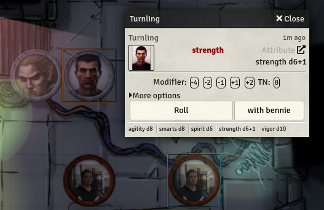

# Better rolls for SWADE (Alpha version)

This is an alpha for version 2 of the module. If you are not familiarized with it you are probably better using the 1.x version.

Please leave your feedback on the official Foundry discord: feel free to ping me if you want. 

Criticism, feature request, UI changes are all welcome, but if you want me to do something about it, please be as detailed as you can with it. Please at least tell me what you expect and why do you believe your approach is better.

This module adds a new rolling mode to the SWADE system that add the ability to make faster and more complex rolls. I truly believe that it makes gaming faster and more enjoyable, but:

* This is more complex than system default rolls. It's quite probably that you don't need it. Please try SWADE without it first and only check it if you feel rolls could be improved.
You need to be familiar with Savage Rolls rules to use it. You need to know which dice are discarded, what is raise damage, and in general it is not a good module for beginners in the system. It could be confusing. So, again, please use the base system and get familiar with it before using this module

## Settings

This module is quite configurable. Most people should take a look at the setting and make sure that they reflect their preferences just after installing. This are the exposed settings:

*Alpha note: Removed settings are only relevant to version 1 and will be removed in the final version

The first options define what happens when you click with different keys pressed. You can choose three actions:

* Default system roll: Better rolls will do nothing, the default system behaviour will be preserved.
* Show BetterRolls card: A card will be shown where you can click to roll with different options (continue reading)
* Show card and trait roll: The same card will be displayed, but it also will make a roll with the default options, show it and if it is enabled show the results

The next setting "See result card" let's you choose if after a roll a result card will be shown, and if it does who can see it: either everybody or just the master. Note that the master can make it public later with the right click context button.

Finally, if you are using Dice So Nice, you can set the theme for the Wild Die. To make it easy to spot it I recommend using a flat theme like white or black.

## Attribute card

This is the card that is shown after clicking in an attribute name:

You can do quite a lot of thing here.

* Click the protrait to open, minimize and maximize the character sheet.
* Click the icon in the upper right (below the trash icon if you are the dm) to oppen the card on a floating window

* Click on any of the squared numbers after the word Modifier to add or substract this number from the total roll.
* Click the squared numbers after TN to change the Target Number (Difficulty) of the roll
* Click on More options to expand a small to form to add your own modifier or target number.

Finally you can click in the big buttons to roll the attribute. If you use the smaller "with bennie" button it will substract one bennie from your pool (or the master pool if you are the master and the actor has no bennies available).

## Result card

After clicking roll the module will roll a standard system roll, if you enabled it in settings it will show a result card after it.

In the above image you can see two cards, the first one is a system roll (with minor modifications), the other one is the result card.

The three boxes are the number rolled on the dice, the modifier and the target number. You can change then after the roll and it will update the result.

## Acknowledgements
- Atropos for making Foundry VTT
- RedReign for Better Rolls 5e
- FloRad for making the SWADE system for Foundry
- All the nice people in the #swade channel of the official discord. Such a great community,

## License
The source code is licensed under GPL-3.0.
