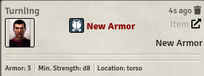
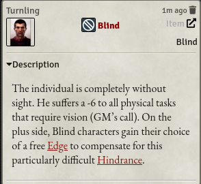
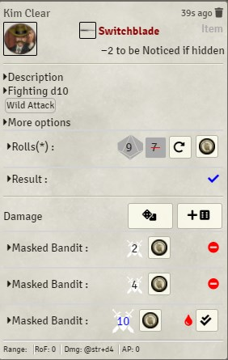
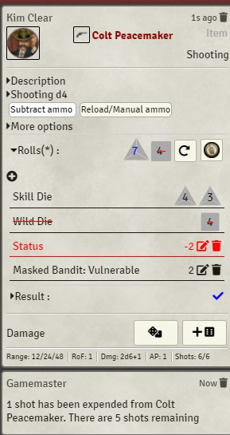
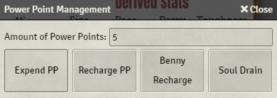

# [index](index.md)

# Card Types

# Attribute card

This is the card that is shown after clicking on an attribute name:

# Skill card

The skill cards are very similar to attribute ones. Please note the collapsed skill description. When rolling multiple Trait dice + Wild die it will show all results.

# Item cards

Item Cards can be broken down into different categories. Gear cards are straightforward, while weapon or power cards add a lot of functionality.

A simple item, like an armor would look like this:

If there is a description available, it will show it.

## Edges and Hindrances

Edges and Hindrances, being treated as items in Foundry VTT have the same look:

## Melee weapons

In this example, the damage has already been rolled. The roll will than be compared with the TN. This is usually 4, but if you have targeted another actor, it will use that actors Parry instead. As described earlier, you can use a reroll or a Benny to alter your result - all earlier rolls will be added to the "Older rolls" row above the rolls section.

If you are satisfied with your skill roll, you can go ahead and roll damage (either normal damage or raise damage):

As you can see, you can also use a Benny to reroll the damage, this will add a new row as shown above. If the damage is sufficient to cause a wound or make an opponent shaken, you will also see the "Apply damage" box. If targeted, the damage roll will be compared against the targets Toughness. (see "Soak Rolls" below)

## Ranged weapons

Ranged weapons work similar than melee weapons but their TN is always 4, if not modified in the "More options" section. In the sample below, *Vulnerable* as well as *Distracted* has been factored in this roll:

Please note the "subtract ammo by default" setting in action. If you selected this option in the Settings, the "Subtract ammo" global action will be selected by default and automatically spend an amount of shots based on the amount of Trait die used (1/5/10/20/40/50). With the "Reload/Manual ammo" option you can define an amount of shots you want to reload or fire (like 6 if you want to fan the hammer in a *Deadlands* session). The weapon cannot load more bullets than its maximum capacity though.

## Power cards

Power cards are very similar to ranged weapons (if they have damaging effects).

Available global actions are "Subtract Power points" - can be activated in the settings as default and "Manual PP management". The automatic solution will always deduct the base amount defined in the power. With the second option you can manually either expend or recharge Power Points

# Soak Rolls

When an actor has been targeted and damaged using the "Apply damage" button, the "Soak card" will appear. This will allow the actor to make a "Soak (Vigor) roll" to spend a Benny and soak damage. This will only be available, if there are Bennies left to spend.