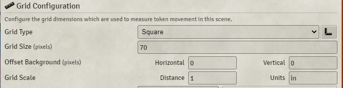
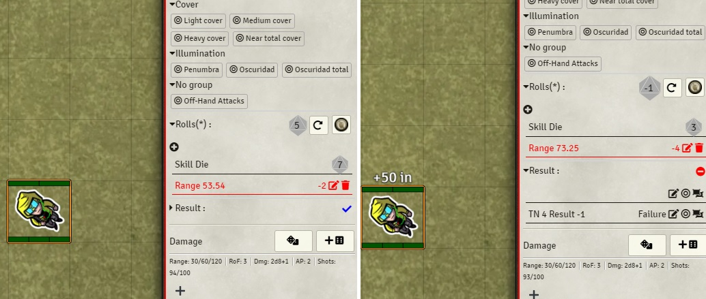
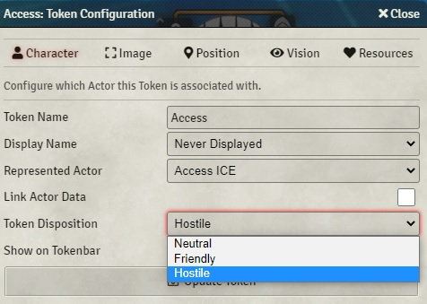
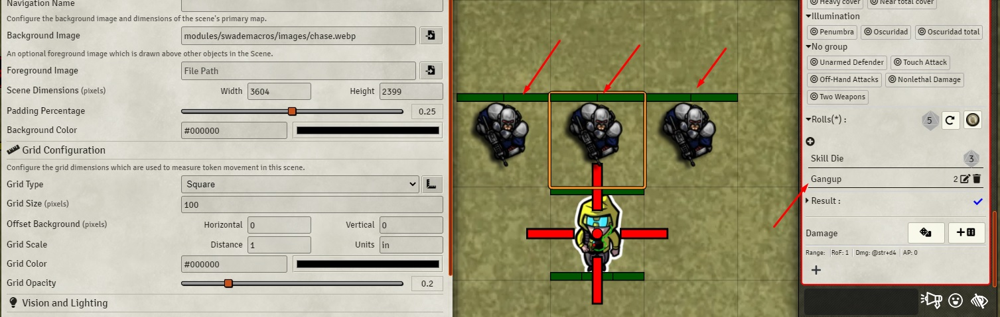
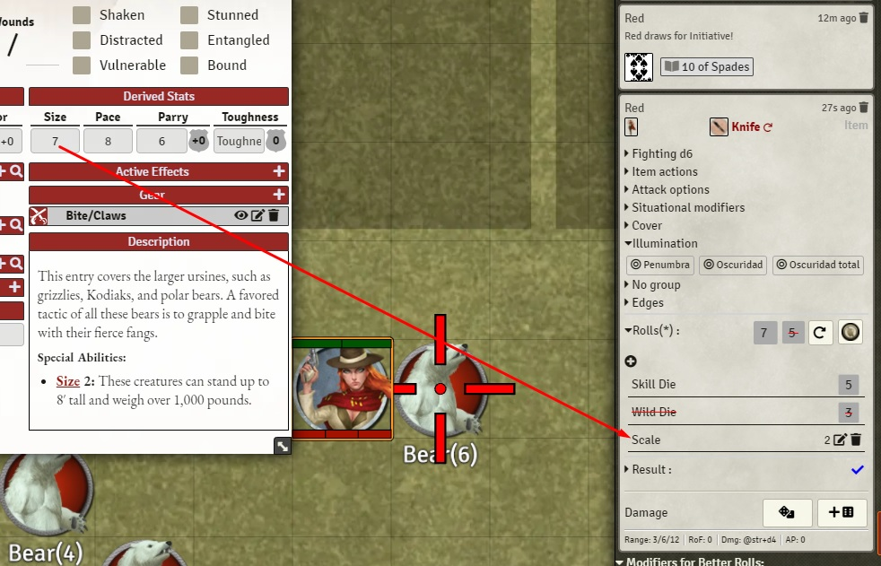

# Combat Automation
Better Roll 2 can account the following:
- Distance, taking in account height.
- Gang Up
- Size/Scale Modifier

# Distance
Make sure your scene has the right distance measures to get best result.

Change the height of a token by right clicking it and adding +/- and a number to the heigth box in the right left corner.

# Gang Up
Gang Up calculation uses **Token Disposition** and distance to trigger.

Requirements
- You must set the PCs as Friendly.
- You must set the hostile NPCs as Hostile.
- They must be near (1 in) see **Grid Scale Image**

The three tokens are set to Hostile. The token in the middle will receive +2 to attack the PC token. You can check p101 from SWADE core or  too.

# Size/Scale Modifier
If you set the size, this will be trigger the bonus/penalty.

 You can learn about Size/Scale at p106 from SWADE Core.

