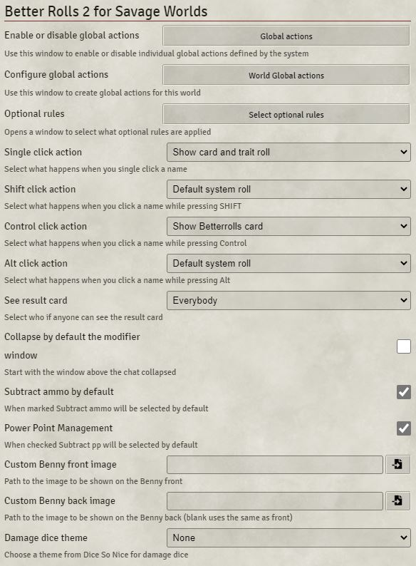
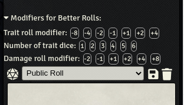

# Better Rolls 2 for SWADE

Please leave your feedback on the official Foundry discord. Feel free to ping me if you want.

Criticism, feature requests, and UI changes are all welcome but, if you want me to do something about it, please be as detailed as you can. Please, at the very least, tell me what you expect and why do you believe your approach is better.

This module adds a new rolling mode to the SWADE system that adds the ability to make faster and more complex rolls. I truly believe that it makes gaming faster and more enjoyable, but:

* This is more complex than system default rolls. It's quite likely that you don't need it. Please try SWADE without it first and only check it out if you feel rolls could be improved.
* You need to be familiar with the rules of Savage Worlds to use it. You need to know e.g. which dice are discarded and how damage is affected by raises; generally speaking, this is not a good module for beginners. It could be confusing. So, again, please use the base system and get familiar with it before using this module.

# Settings

Better Rolls 2 comes with a variety of settings:

See [SETTINGS](settings.md)

# Anatomy of a Better Rolls Card
Learn about the template for the Better Rolls cards [here](anatomy.md).

See [ANATOMY OF A BETTER ROLLS CARD](anatomy.md)

# Modifier row

Better Rolls 2 will add this section above the chat window

You can use this to quickly add modifiers to a roll.

You can either set a one time modifier or a persistent modifier. If you click once, the selected icon will turn white and will be deselected after one roll. Click twice, it will turn red and will apply to any roll until you deselect it.

Use the "Trait roll modifier" line to affect any trait roll either from a skill, attribute or item.

Use "Number of trait dice" to use multiple trait dice on a skill roll, either from a skill, attribute or item card.

Finally the "Damage roll modifier" adds modifiers to damage rolls.

If you prefer to hide this section, you can find an option to collapse it by default in the settings.

# Card Types

See [Card Types](card_types.md).

# More Functionalities
- Drag and Drop
- Custom Bennies
- See [GLOBAL ACTIONS](global_actions.md) for more information on how to create global actions.
- Macros and API

See [MORE FUNCTIONALITIES](more_functionalities.md).

# Other Modules

## Integrations

* **Dice so Nice:** This module supports using a different theme for the damage dice when you are using Dice so Nice. You can select it in the module settings (see above)
* **Dice Tray:** If Dice Tray is enabled, better rolls will use it's modifier box in addition to all other options.

## Recommendations

Better Rolls for SWADE works well with the SWADE Toolkit module: https://foundryvtt.com/packages/swade-toolkit/

## Known incompatibilities

* SWADE Tools and Better Rolls implement similar things in very different ways. Since both modules affect the same functionalities, neither can live while the other survives (please don't have them active at the same time).
* ModBox and Better Rolls do not work together

# About
- Authors
- Translations
- Acknowledgements
- License

See [ABOUT](about.md).