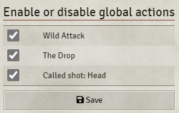
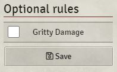

# [index](index.md)

# Global Actions

Global actions are pre-defined global actions that are ready to use. You can choose to disable them, if they should not be available in your setting.

See [GLOBAL_ACTIONS.md](global_actions.md) for more information on how to create global actions.

# Optional rules

This setting allows you to quickly enable optional rules. Currently, only _Gritty Damage_ is supported.

# Better Rolls 2 card configuration

Better Rolls 2 offers a few display modes that you can switch between using different click actions:

## Show Better rolls card (Default)
This option will display the Better Rolls 2 card, when single clicking on a Trait, Weapon or Power. See details below. This option is useful, if you need to add some settings on the card itself (like global actions; e.g. Wild Attack, changes in Ammo or Power Point handling).

## Show card and trait roll
This option will display the card and automatically rolling the selected trait (powers and weapons rely on the arcane/weapon skill). It will automatically factor in the Better Rolls modifiers from the chat bar as well as modifications through Wounds, Fatigue, or states like *Distracted* or *Vulnerable*. Additionally, the selected “Modifiers for Better Rolls” will apply.

## Show card and roll trait and damage
See above, but the damage will also be rolled automatically-

# Default system roll
This will open the default modification popup window of the SWADE rule system.

Other options allow to switch on and off the automatic ammo and power point handling (see below), the uploading of custom benny images and the option to select a different Dice so nice! theme for your damage dice.